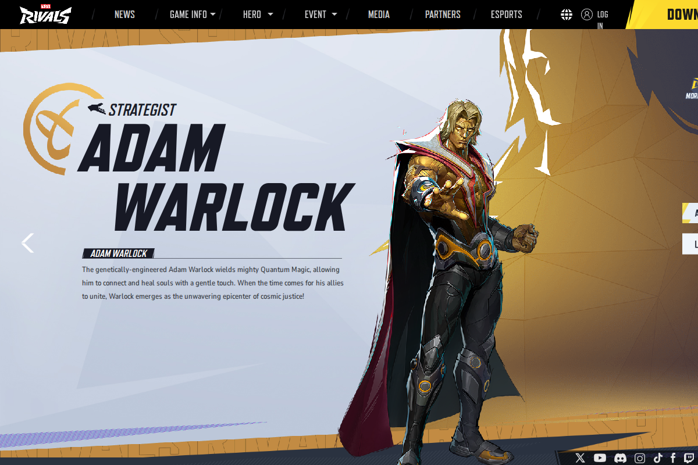
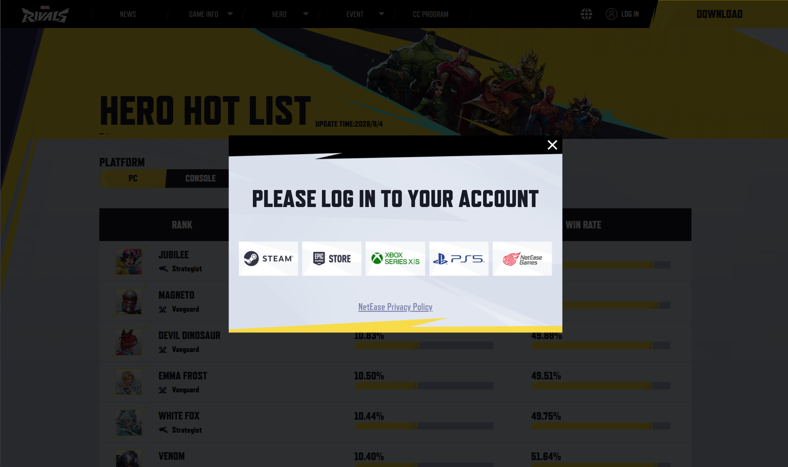
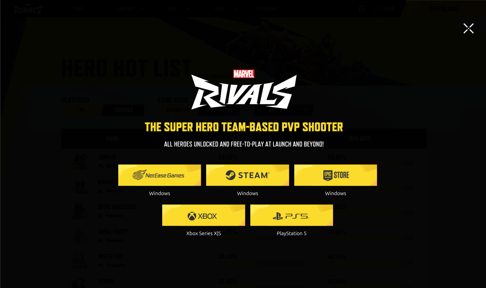

# 🖥️ Testes Exploratórios — Frontend (Marvel Rivals Heroes)

Esta documentação consolida as descobertas obtidas durante o mapeamento e estudo exploratório do frontend oficial do **Marvel Rivals** na página de heróis. O objetivo é apresentar os elementos da interface mapeados, comportamentos dinâmicos identificados e orientações claras de como automatizar os testes usando a biblioteca **Browser (Playwright) com Robot Framework**.

---

## 🌐 Estrutura Geral da Página

A página de heróis do Marvel Rivals (`https://www.marvelrivals.com/heroes/index.html`) é um portal interativo dinâmico que carrega componentes via JavaScript.




### 🕵️‍♂️ Mapeamento de Seletores CSS para Automação

Para estruturar nossa suíte de automação E2E usando **Browser Library**, identificamos os principais elementos e seus seletores CSS estáveis:

| Área/Elemento | Seletor CSS Recomendado | Ação Esperada / Comportamento |
|---|---|---|
| **Container Principal** | `css=#wrap.wrap.heroesDetails` | Confirmar que a estrutura principal da página de detalhes/heróis carregou. |
| **Barra de Navegação** | `css=.header-nav` | Menu principal superior. |
| **Logo Marvel Rivals** | `css=.nav-logo img` | Logo oficial no topo esquerdo. Deve ser clicável para voltar ao início. |
| **Menu Dropdown HERO** | `css=.nav5-select` | Exibe as opções: `HEROES`, `TEAM-UP` e `HERO HOT LIST`. |
| **Botão LOG IN** | `css=#roleinfo .btn-login` | Abre o modal de login do usuário. |
| **Modal de Login** | `css=.pop-login` | Exibe opções de autenticação (Steam, Epic, XBOX, Playstation, NetEase). |
| **Fechar Modal Login**| `css=.login-close` | Fecha o modal de login. |
| **Botão DOWNLOAD** | `css=.go-steam.xlz-btn4` | Abre o modal com links de downloads por plataformas. |
| **Modal de Downloads**| `css=.yxz-pop` | Exibe opções de download (Windows, Steam, Epic, PS5, Xbox). |
| **Fechar Modal Download**| `css=.yxz-close` | Fecha o modal de download de plataformas. |
| **Ícones de Redes Sociais**| `css=.icons .icon-x`, `.icon-ytb` | Links externos oficiais (X/Twitter, YouTube, Discord, etc.). |
| **Seletor de Idioma** | `css=.lang` | Dropdown que revela links de idioma (English, 日本語, 한국어). |

---

## ⚙️ Comportamentos Especiais Identificados

Durante a exploração técnica do código-fonte e da página, mapeamos dois pontos críticos que impactam diretamente a nossa estratégia de automação:

### 1. Detecção de Dispositivos Móveis e Redirecionamento Automático
No cabeçalho do arquivo HTML, existe um script inline (`<script data-fixed="true">`) que intercepta o carregamento:
```javascript
if (/iphone|android|ipod/i.test(navigator.userAgent.toLowerCase()) == true
    && params(location.search, "from") != "mobile"
    && window.location.host.indexOf('9000') === -1) {
    location.href = window.location.href.replace('marvelrivals.com/heroes/', 'marvelrivals.com/m/heroes/');
}
```
* **⚠️ Impacto no Teste**: Se rodarmos o teste simulando um dispositivo móvel (alterando o viewport e o User-Agent), a página redirecionará automaticamente para `/m/heroes/` (a versão mobile). Precisamos decidir na nossa suíte de testes se vamos validar essa regra de redirecionamento ou se vamos fixar o User-Agent como Desktop para evitar redirecionamento indesejado nos testes de UI Desktop.

### 2. Renderização Assíncrona e Dependência de CDNs
* Os heróis e suas mídias são renderizados dinamicamente via JS (`heroes/index_3aec8dda.js`).
* **⚠️ Impacto no Teste**: Testar esta página usando requisições simples de parse de HTML (como BeautifulSoup do Python) **não funcionará**, pois o HTML inicial vem praticamente vazio de dados. O uso do **Playwright (Browser Library)** é mandatório porque ele executa o JavaScript da página, aguarda as chamadas de rede e monta o DOM final.

---

## 🔬 Cenários de Teste Exploratório Realizados (Visual)

### Cenário 1: Abertura e Carregamento do Modal de Login
* **Passos**:
  1. Acessar `https://www.marvelrivals.com/heroes/index.html`.
  2. Clicar no botão `LOG IN` no cabeçalho superior direito.
  3. Validar se o modal de login (`.pop-login`) aparece na tela.
  4. Validar as opções disponíveis (Steam, Epic, XBOX, Playstation).
  5. Clicar no botão fechar (`.login-close`) e garantir que o modal suma.
* **Resultado**: O modal abre com animação suave de fade-in e sobrepõe a tela (overlay escuro). A interação de fechar funciona perfeitamente, removendo a classe `.is-active` do modal.

* **Evidência Visual**:
  


### Cenário 2: Abertura e Carregamento do Modal de Download
* **Passos**:
  1. Acessar a página de heróis.
  2. Clicar no botão `DOWNLOAD` no canto superior direito.
  3. Validar se o modal `.yxz-pop` é exibido.
  4. Validar os botões de plataformas (Windows, Steam, Epic, PS5, Xbox Series X|S).
  5. Clicar no botão fechar (`.yxz-close`).
* **Resultado**: O modal abre corretamente listando todos os links externos oficiais para as respectivas lojas de jogos.

* **Evidência Visual**:
  


### Cenário 3: Troca de Idioma no Menu Dropdown
* **Passos**:
  1. Passar o mouse (Hover) ou clicar sobre o ícone do seletor `.lang`.
  2. Verificar a lista de idiomas disponíveis (`.lang .lans li`).
  3. Clicar no link de outro idioma (ex: `日本語` ou `한국어`).
  4. Garantir que a URL mude correspondendo ao idioma selecionado.
* **Resultado**: O menu abre ao passar o mouse. Ao clicar em "日本語", a navegação redireciona para `https://www.marvelrivals.com/jp/index.html` com sucesso.

---

## 🎯 Dicas de Implementação no Robot Framework (Browser Library)

Para garantir que nossos testes de frontend fiquem estáveis (sem falsos negativos / "flakiness"), devemos adotar as seguintes práticas:

### 1. Utilizar Esperas Inteligentes (Implicit/Explicit Waits)
Sempre aguarde o estado de um elemento ser alterado antes de interagir:
```robot
# Exemplo de Keyword Robot
Aguardar e Clicar no Botão Login
    Wait For Elements State    css=#roleinfo .btn-login    visible    timeout=10s
    Click                      css=#roleinfo .btn-login
    Wait For Elements State    css=.pop-login              visible    timeout=5s
```

### 2. Configurar o Contexto do Browser Corretamente
Para evitar problemas com o redirecionamento mobile durante testes desktop:
```robot
Abrir Navegador na Página de Heróis
    # Forçamos o viewport de desktop e aceitamos a geolocalização se necessário
    New Browser    browser=chromium    headless=True
    New Context    viewport={'width': 1920, 'height': 1080}
    New Page       https://www.marvelrivals.com/heroes/index.html
```

### 3. Limpeza do Estado (Teardown)
Garantir que fechamos modais abertos no final de cada teste ou recarregamos a página para que o próximo teste comece de um estado limpo:
```robot
[Teardown]    Take Screenshot    filename=result_screenshot
```
