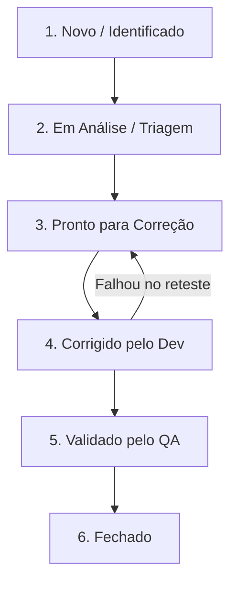

# 🐛 Registro de Bugs e Inconsistências — Marvel Rivals Hub

Este documento é o repositório central de bugs, falhas e desvios de comportamento identificados durante a execução dos testes exploratórios e automatizados no **Marvel Rivals Hub**. 

---

## 🔄 Fluxo de Ciclo de Vida de Bugs Adotado

Para garantir a comunicação transparente e rápida entre QA e Engenharia, adotamos o seguinte fluxo:



---

## 📝 Lista de Bugs e Oportunidades de Melhoria

Abaixo estão detalhados os problemas técnicos encontrados durante os estudos exploratórios da API e do Frontend.

### 🐛 BUG-01: HTTP Status Code Inconsistente em Requisições Não Autenticadas
* **Componente**: API (MarvelApp GraphQL)
* **Severidade**: 🟡 Média (Inconsistência de Padrão)
* **Status**: `Novo`

#### Descrição
Quando uma requisição GraphQL é feita sem o cabeçalho `Authorization`, o servidor redireciona o request para um schema limitado público (`PublicQueries`). Se a consulta incluir campos privados (como `user`), a API rejeita a requisição com HTTP Status `400 Bad Request`.
* **Comportamento Esperado**: Requisições não autenticadas a recursos privados devem retornar HTTP `401 Unauthorized` imediatamente no cabeçalho, seguindo as diretrizes padrão da especificação RFC 6750 (OAuth 2.0).
* **Comportamento Encontrado**: O servidor retorna HTTP `400 Bad Request` com erro sintático do parser GraphQL.

#### Passos para Reproduzir
1. Realizar uma requisição POST para `https://api.marvelapp.com/graphql/`.
2. Sem incluir o cabeçalho `Authorization`.
3. Payload JSON: `{"query": "{ user { username email } }"}`.
4. Observar os cabeçalhos de resposta HTTP e o JSON retornado.

#### Evidência (Log da Resposta)
```http
HTTP/2 400
content-type: application/json

{"info":[{"message":"Your request was unauthenticated - you are using a limited schema...","documentation":"https://marvelapp.com/developers/documentation/authentication/"}],"errors":[{"message":"Cannot query field \"user\" on type \"PublicQueries\"."}]}
```

#### Solução Recomendada
Configurar o middleware de segurança do servidor de API para interceptar tokens ausentes ou expirados na rota de GraphQL e responder com `401 Unauthorized` antes que o validador do schema GraphQL processe a query.

---

### 🐛 BUG-02: Filtro de Mobile Baseado Apenas em Regex do User-Agent (Frágil)
* **Componente**: UI (Marvel Rivals Heroes)
* **Severidade**: 🟡 Média (Problema de Responsividade/Layout)
* **Status**: `Novo`

#### Descrição
A página de heróis realiza a detecção de dispositivos móveis através de uma expressão regular simples (`/iphone|android|ipod/i`) aplicada à propriedade `navigator.userAgent`. Dispositivos como o iPad Pro (que utilizam o Safari com User-Agent idêntico ao MacOS de desktop por padrão) ou tablets modernos de alta resolução em modo paisagem não são redirecionados para a versão mobile `/m/heroes/`, resultando em elementos visuais mal posicionados ou cortados.
* **Comportamento Esperado**: A adaptação para dispositivos móveis ou o redirecionamento deve considerar as dimensões físicas da tela (ex: `@media` queries ou largura do viewport) e não apenas a string do User-Agent.
* **Comportamento Encontrado**: A verificação é estritamente textual no User-Agent do navegador.

#### Passos para Reproduzir
1. Abrir um emulador de dispositivo ou tablet (como o iPad Pro 11) com largura de viewport média (ex: 834px).
2. Garantir que o User-Agent não contenha o termo literal "ipad" ou "iphone" (comportamento padrão do iPadOS moderno).
3. Acessar `https://www.marvelrivals.com/heroes/index.html`.
4. Observar que a página carrega o layout de Desktop gigante, forçando zoom e barra de rolagem horizontal desnecessários.

#### Solução Recomendada
Utilizar CSS responsivo nativo via `@media (max-width: 1024px)` para ocultar/exibir elementos no mesmo arquivo HTML, reduzindo a dependência de scripts JS inline para redirecionamento físico de páginas.
